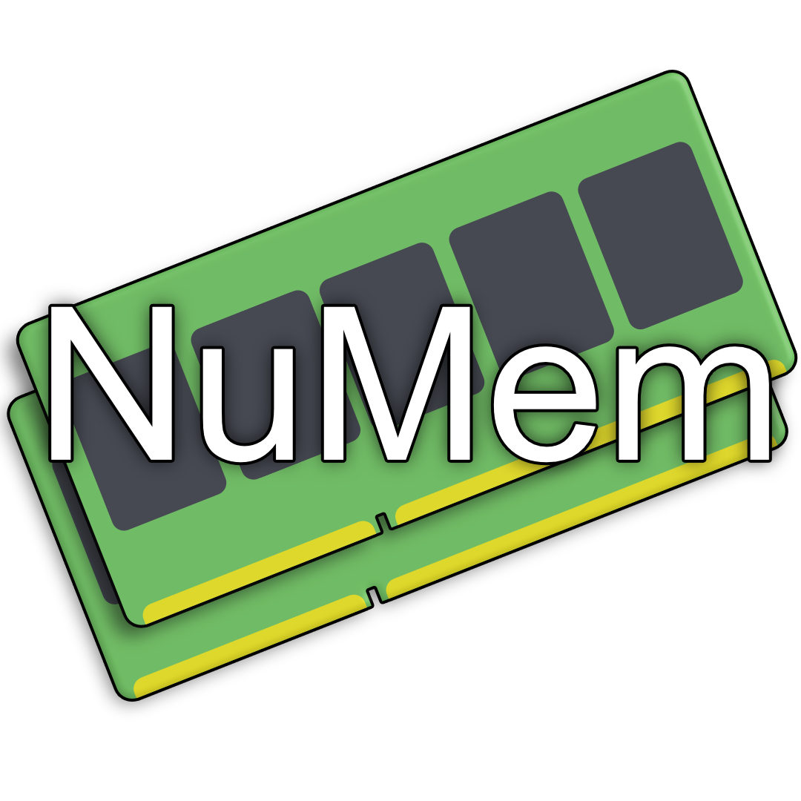

<p align="center">
  
</p>

[](https://github.com/Inochi2D/numem/actions/workflows/pushes.yml)

Nu:Mem is a package for D which implements various nogc memory managment tools, allowing classes, strings, and more to be handled safely in nogc mode.
This library is still a work in progress, but is intended to be used within Inochi2D's nogc rewrite to allow the library to have good ergonomics, 
while allowing more seamless integration with other programming languages.

&nbsp;
&nbsp;
&nbsp;

# Roadmap
This is a incomplete and unordered roadmap of features I want to add and have added

 - [x] Utilities for managing D classes with no gc
   - [x] nogc_new (nogc new alternative)
   - [x] nogc_delete (nogc destroy alternative)
 - [x] Smart (ref-counted) pointers.
   - [x] shared_ptr (strong reference)
   - [x] weak_ptr (weak, borrowed reference)
   - [x] unique_ptr (strong, single-owner reference)
 - [x] C++ style vector struct
 - [x] C++ style string struct
 - [x] C++ style map
 - [x] C++ style set
 - [x] nogc compatible exceptions (must derive from NuException)
 - [ ] Safe nogc streams\*\*
   - [x] FileStream\*
   - [x] MemoryStream\*
   - [ ] NetworkStream
 - [x] Endianness utilities
 - [x] Support for minimal D runtime
   - [x] tinyd-rt\*\*
 - [x] File handling\*\*
   - [x] Check if file exists
   - [ ] Iterate directories
   - [ ] Cross platform path handling
 - [ ] Networking
   - [ ] Sockets
   - [ ] IP utilities
 - [ ] Character encoding handling
   - [ ] Unicode
   - [ ] Allow plugging more handlers in?
 - [ ] String formatting (compatible with phobos syntax?)

\*: Implemented but untested.  
\*\*: Partially implemented.

# Using numem
Numem allows you to instantiate classes without the GC, it's highly recommended that you mark all functions in classes as @nogc to avoid GC conflicts.  

Using `nogc_new` you can instantiate types on the heap, and `nogc_delete` can destruct and free types.

```d
import numem.all;

class MyClass {
@nogc:
    void doSomething() {
        import core.stdc.stdio : printf;
        printf("Hello, world!\n");
    }
}

void main() {
    MyClass klass = nogc_new!MyClass();
    klass.doSomething();

    nogc_delete(klass);
}
```

All features of classes are available without the GC, such as subclassing and interfaces.

# Smart Pointers
Numem features smart pointers, which allows you to reference instantiated types.  
If a smart pointer is placed on the stack then it will be freed automatically on the exit of the scope.

```d
import numem.all;

class MyClass {
@nogc:
    void doSomething() {
        import core.stdc.stdio : printf;
        printf("Hello, world!\n");
    }
}

void func() {
    // Will instantiate a shared_ptr on the stack, referencing MyClass.
    shared_ptr!MyClass klass = shared_new!MyClass();

    // alias this is used, so you can call members of the contained
    // type directly.
    klass.doSomething();
}

void main() {
    // After this call klass should be freed automatically.
    func();
}
```

Smart pointers are split in to 3 categories:
 * `unique_ptr` - This smart pointer is the only owner of a piece of memory.  
   Assining the smart pointer will move the owner between `unique_ptr`s  

 * `shared_ptr` - This smart pointer can be copied and have multiple owners.  
   Once all owners are freed, the content of the `shared_ptr` will also be freed.  

 * `weak_ptr` - This smart pointer is created via the `borrow()` function of `unique_ptr` and `shared_ptr`.  
   Weak pointers do not own the memory they reference, but nontheless keep track of the state of the parent pointer.  
   Weak pointers `get()` function will return `null` if the owners of the memory have freed it.

# C++-style Vectors and Maps
Numem includes `vector`, `map` and `set` types, which are alternatives to D dynamic arrays, associative arrays and sets.  
Each of these types are split in to their base type and a `weak` counterpart. The "strong" containers will free elements on removal, and the weak counterparts will not.

The `nstring` type is a UTF-8 container for text, which uses `vector` as a backing store. `nstring` will automatically create null terminators when the string is modified. The functions `toCString()` and `toDString()` do not make copies of the string, but just return a pointer to its start, or a slice of it (excluding the null terminator).  
This allows `nstring` to have excellent C interop at minimal performance cost.

# Tracing leaks
You can build numem with the `--debug=trace` flag to trace creation and destruction of types via stdout.

# Note
Some parts of the library will pretend GC'ed types are no-gc, as such you should be careful about mixing GCed code in.
